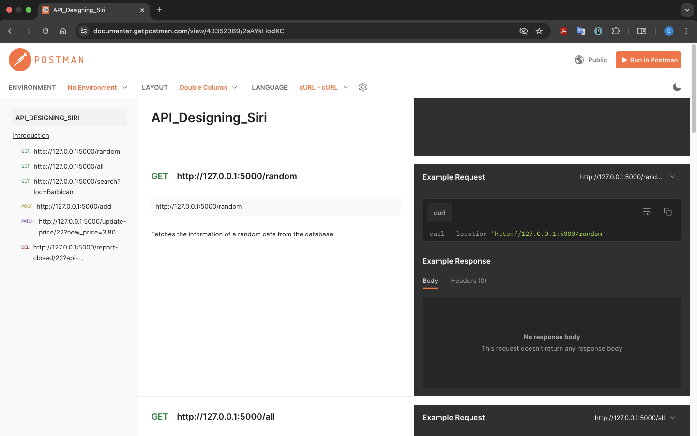

# Cafe & Wifi API ☕🌐  
# API_design
Designed a RESTful API from scratch using flask

This project is a **RESTful API** built using Flask, which provides information about cafes and their WiFi availability. The API supports CRUD operations and can be tested using Postman.  

## 📌 Features  
- **GET**: Retrieve cafe data from the database.  
- **POST**: Add new cafes.  
- **PATCH**: Update cafe details (e.g., WiFi price).  
- **DELETE**: Remove cafes from the database.
- **API Authentication** : Using API keys

## 📸 API Documentation  
You can explore the full API documentation in Postman:  
🔗 [Postman API Docs](https://documenter.getpostman.com/view/43352389/2sAYkHodXC)  

## 🖼 API Preview  
Here is a preview of the API in action:  

  

## 🚀 How to Run 

1. **Clone the Repository**  
   ```bash  
   git clone https://github.com/siriparamesh/RESTful_APIs_Designing.git  
   cd RESTful_APIs_Designing  
   ```  

2. **Install Dependencies**  
   ```bash  
   pip install -r requirements.txt  
   ```  

3. **Run the API**  
   ```bash  
   python main.py  
   ```  

4. **Access the API Endpoints**  
   - `GET /random` → Fetches a random cafe.  
   - `GET /all` → Retrieves all cafes.  
   - `GET /search?loc=Barbican` → Finds cafes in a specific location.  
   - `POST /add` → Adds a new cafe.  
   - `PATCH /update-price/22?new-price=3.80` → Updates WiFi pricing.  
   - `DELETE /report-closed/22?api-key=...` → Deletes a cafe Only through proper Authentication
     

## 🎯 Tech Stack  
- **Flask** (Backend)  
- **SQLite** (Database)  
- **Postman** (Testing)  

## ✨ Additional Info  
This API was built as part of learning **RESTful API design** and **backend development** using Flask. The frontend (if needed) is hosted as `index.html`.  

---  

📌 *Happy Coding!* 🚀  
